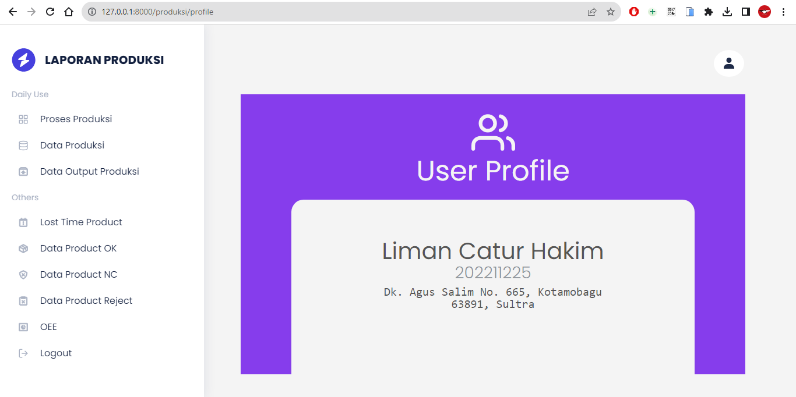

# product

Repository Product

Repository untuk program skripsi Laporan Produksi

Fitur yang tersedia :

> > > Vismen List Order  
> > > Tambah Vismen List Order  
> > > Cetak Batch Dalam  
> > > Posting Good Received  
> > > Edit Good Received  
> > > Cetak Batch Luar  
> > > List Product OK  
> > > List Product NC  
> > > List Product Reject  
> > > Data Lost Time  
> > > Tambah Data Lost Time  
> > > Login Produksi  
> > > Login PPIC  

Untuk penggunaan atau pemasangan silahkan buka file Dokumentasi.txt

   

   

   

   

   

   

   

   

   

   

   

   
